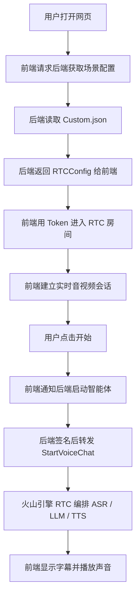

# Project1 交互式 AIGC 场景 Demo

这是一个基于火山引擎 RTC 的互动式语音客服 Demo。  
它不是“前端直接连一个大模型接口”那么简单，而是把网页、RTC 房间、ASR 语音识别、LLM 大模型和 TTS 语音合成串成一条完整链路。

如果你先想抓住主线，只要记住这三句话：

- **前端**负责页面、麦克风、摄像头、播放、RTC 房间连接
- **后端**负责读取配置、生成/校验 RTC 信息、做鉴权、转发“启动智能体”的请求
- **火山引擎云端**负责把 ASR、LLM、TTS 串起来完成实时语音对话

---

## 这项目里到底有哪些部分

### 前端

前端代码都在 `src/` 目录下，技术栈是 React + Redux + 火山引擎 RTC Web SDK。

前端主要做这些事：

- 打开网页，展示场景和对话界面
- 请求后端获取场景列表和 RTC 房间信息
- 用 RTC SDK 进入房间
- 打开麦克风、摄像头、屏幕共享
- 采集用户语音
- 播放 AI 返回的音频
- 显示字幕、对话内容、设备状态、房间状态
- 把“开始/停止智能体”的请求发给后端

前端关键文件：

- `src/index.tsx`：React 入口，挂载 Redux Provider
- `src/App.tsx`：页面路由入口
- `src/pages/MainPage/index.tsx`：主页面入口，启动时请求场景配置
- `src/pages/MainPage/MainArea/Antechamber/index.tsx`：进房前页面，点击开始加入 RTC
- `src/pages/MainPage/MainArea/Room/index.tsx`：进房后页面，显示房间、字幕、音视频和操作区
- `src/pages/MainPage/Menu/index.tsx`：右侧信息区，显示 AI 人设、版本、房间信息
- `src/lib/useCommon.ts`：封装了加入房间、设备权限、场景读取等 React hooks
- `src/lib/RtcClient.ts`：RTC 客户端封装，负责创建引擎、加入房间、采集音视频、发布流、启动/停止 AI
- `src/store/slices/room.ts`：房间状态、场景配置、RTC 配置、对话状态
- `src/store/slices/device.ts`：设备列表和设备权限状态
- `src/app/base.ts`：统一请求封装，前端通过它调用本地后端
- `src/app/api.ts`：定义前端要调用的接口
- `src/config/index.ts`：后端代理地址配置

### 后端

后端代码都在 `Server/` 目录下，技术栈是 Node.js + Koa。

后端主要做这些事：

- 读取 `Server/scenes/*.json`
- 把场景配置整理成前端需要的格式
- 如果 `RTCConfig` 缺少某些字段，自动补齐或生成
- 用 `AccountConfig` 里的 `AK/SK` 做签名鉴权
- 接收前端的 `StartVoiceChat` / `StopVoiceChat` 请求并转给火山引擎 RTC OpenAPI

后端关键文件：

- `Server/app.js`：核心后端入口，包含 `getScenes` 和 `proxy` 两个主要接口
- `Server/util.js`：通用工具，负责读取场景文件、统一返回格式、参数校验
- `Server/token.js`：RTC Token 生成逻辑
- `Server/scenes/Custom.json`：你需要填写的场景配置文件
- `Server/README.md`：后端单独的简要说明

### 其它 Python 目录

仓库里还有两个 Python 目录：

- `server_python/`
- `rag_llm_server/`

其中 `server_python/main.py` 可以理解成 Python/FastAPI 版后端。  
它和 `Server/app.js` 的核心职责很像，都是：

- 读取 `scenes` 场景配置
- 给前端返回 `getScenes`
- 接收 `StartVoiceChat` / `StopVoiceChat`
- 用 `AK/SK` 签名
- 转发给火山引擎 RTC OpenAPI

所以你可以把它们理解成“两套后端实现”：

- `Server/app.js`：Node.js 版后端
- `server_python/main.py`：Python/FastAPI 版后端

前端逻辑基本不用变，后端选一套跑就行，不需要两套同时启动。  
这个仓库默认的最短启动路径是 Node.js 版，也就是 `Server/app.js`。

`rag_llm_server/` 更偏扩展示例，用来演示自定义 LLM/RAG 回调链路。  
如果你的目标只是“网页先跑起来”，先重点看 `src/` 和 `Server/` 就够了。

---

## 先分清两种“交互”

很多人一开始会混淆“前端和 RTC 的交互”以及“后端和火山引擎 OpenAPI 的交互”。  
其实它们不是一回事。

### 1. 前端和 RTC SDK 的交互

这部分发生在浏览器里，前端会直接做这些事：

- 拿到 RTC `Token`
- 进入 RTC 房间
- 打开麦克风、摄像头
- 采集用户语音
- 播放 AI 返回的音频
- 监听房间里用户和设备状态变化
- 控制本地设备、字幕、全屏和房间状态

这部分代码主要在：

- [`src/lib/RtcClient.ts`](/Users/johnxu/Documents/project1学习/ark_aigc_demo/src/lib/RtcClient.ts)
- [`src/lib/useCommon.ts`](/Users/johnxu/Documents/project1学习/ark_aigc_demo/src/lib/useCommon.ts)

### 2. 后端和火山引擎 RTC OpenAPI 的交互

这部分不是浏览器直接做，而是由后端代替浏览器完成。  
当用户点击“开始”之后，前端会通知后端，后端再去调用火山引擎的 `StartVoiceChat` 接口。

后端会做这些事：

- 读取 `Server/scenes/Custom.json`
- 拿到 `AccountConfig` 里的 `AK/SK`
- 对 RTC OpenAPI 请求做签名
- 把 `StartVoiceChat` 或 `StopVoiceChat` 发给火山引擎

这部分代码主要在：

- [`Server/app.js`](/Users/johnxu/Documents/project1学习/ark_aigc_demo/Server/app.js)

### 3. 云端真正做什么

火山引擎云端负责的是：

- ASR：把你说的话转成文字
- LLM：根据文字生成回答
- TTS：把回答再合成语音

所以你可以这样记：

- **前端**负责“人和房间怎么连”
- **后端**负责“怎么安全地把启动请求送到云端”
- **云端**负责“智能客服真正回答你”

### 一个更小的文字流程图

```text
用户
  ↓
前端网页
  ↓ 请求 getScenes
后端 Node 服务
  ↓ 读取 Custom.json
RTC 房间配置返回给前端
  ↓
前端 RTC SDK 进房间
  ↓ 点击开始
前端把启动请求发给后端
  ↓
后端用 AK/SK 转发到火山引擎 RTC OpenAPI
  ↓
火山引擎 RTC / ASR / LLM / TTS
  ↓
前端显示字幕并播放声音
```

### 房间是固定还是动态

这个 Demo 里，房间信息既可以写死，也可以让后端动态生成。

- **写死**：适合本地测试，大家都用同一个 `RoomId` 和 `UserId`
- **动态生成**：适合多人访问，每次新进来的人拿到新的 `RoomId` / `UserId` / `Token`

你可以这样理解：

- `RoomId` 是房间号
- `UserId` 是进房的人
- `Token` 是进房门票

如果所有人都用同一个 `RoomId`，就会进到同一个房间里。  
所以：

- **本地跑通 Demo** 可以先写死
- **正式上线多人使用** 应该让后端给每个人生成新的房间信息

这个项目的后端会在 `getScenes` 里检查这些值：

- 如果 `RoomId`、`UserId`、`Token` 没填
- 就会自动生成
- 再把新的值返回给前端

所以你可以把它记成：

- **房间规则放在 JSON 里**
- **房间编号和门票可以由后端动态生成**

---

## 整体业务流程

这个 Demo 的主流程可以分成 10 步：

1. 用户打开网页
2. 前端先请求后端的 `getScenes`
3. 后端读取 `Server/scenes/Custom.json`
4. 后端把场景配置和 RTC 房间信息返回给前端
5. 前端拿到 `RTCConfig`，用 RTC SDK 进入房间
6. 用户点击“开始”
7. 前端把“启动智能体”请求发给后端
8. 后端用 `AK/SK` 签名后，把请求转给火山引擎 RTC OpenAPI
9. 火山引擎 RTC 按 `VoiceChat` 的配置串起 ASR、LLM、TTS
10. 前端继续显示字幕、播放声音、更新状态

### 一张最好记的流程图



### 为什么不是“前端直接调一个普通 API”

因为 RTC 不是普通的 HTTP 请求-响应接口，它还要和浏览器的实时媒体能力绑定：

- 浏览器要直接拿麦克风和扬声器
- 浏览器要处理实时音视频流
- 浏览器要维护长连接和设备状态
- 浏览器要显示字幕、房间状态和对话状态

这些动作天然发生在前端，所以 RTC 的实时会话一定要由前端来做。  
而后端最适合做的是：

- 保存和读取配置
- 保护密钥，不把 `AK/SK` 暴露给浏览器
- 给 RTC/OpenAPI 做签名
- 发起 `StartVoiceChat` / `StopVoiceChat`

你可以把它记成：

- **前端管“实时会话和设备交互”**
- **后端管“安全鉴权和启动请求转发”**

---

## 配置文件怎么分

`Server/scenes/Custom.json` 里主要分三块：

- `AccountConfig`：火山引擎 IAM 的 `AK/SK`，给后端签名调用 OpenAPI 用
- `RTCConfig`：网页进 RTC 房间要用的信息，包括 `AppId`、`RoomId`、`UserId`、`Token`
- `VoiceChat`：启动智能体时要下发给 RTC AIGC 服务的完整配置，包括 `ASRConfig`、`TTSConfig`、`LLMConfig`

最容易混的点：

- `AccountConfig` 不是 LLM 的 key
- `RTCConfig` 不是模型配置
- `VoiceChat.LLMConfig.EndPointId` 才是你在火山方舟里创建的推理接入点 ID

---

## 快速开始

### 1. 启动后端

进入项目根目录后：

```bash
cd Server
yarn
yarn dev
```

### 2. 启动前端

回到项目根目录后：

```bash
yarn
yarn dev
```

### 3. 填写场景配置

先把 `Server/scenes/Custom.json` 填好，至少要有：

- `AccountConfig.accessKeyId`
- `AccountConfig.secretKey`
- `RTCConfig.AppId`
- `RTCConfig.AppKey` 或者可由后端自动生成 Token 的必要信息
- `VoiceChat.AppId`
- `VoiceChat.AgentConfig.TargetUserId[0]`
- `VoiceChat.Config.ASRConfig.ProviderParams.AppId`
- `VoiceChat.Config.TTSConfig.ProviderParams.app.appid`
- `VoiceChat.Config.LLMConfig.EndPointId`

如果你已经拿到控制台里的参数，把它们写进同一个 `Custom.json` 就行。  
后端会读取这份文件，前端也会从后端拿到同一份场景信息。

---

## 常见问题

- **启动后一直卡在“AI 准备中”**
  - 检查相关服务是否已开通
  - 检查 `AK/SK`、`RTC AppId/AppKey`、`LLM EndpointId`、`ASR/TTS AppId` 是否填写正确
  - 检查房间是否已经有旧任务没挂断

- **浏览器提示 `token_error`**
  - 检查 `RTCConfig.Token` 是否合法
  - 检查 `RoomId`、`UserId` 是否和生成 Token 时保持一致

- **麦克风或摄像头打不开**
  - 检查页面是否在 `localhost` 或 HTTPS 下运行
  - 检查浏览器权限是否已经允许

- **`Invalid 'Authorization' header`**
  - 通常是 `Server/scenes/Custom.json` 里的 `AccountConfig.accessKeyId` 或 `secretKey` 不正确

- **`[StartVoiceChat]Failed`**
  - 如果 `RoomId`、`UserId` 是固定值，重复启动前要先 `StopVoiceChat`

---

## 代码阅读顺序建议

如果你想快速读懂代码，建议按这个顺序：

1. 先看 `src/pages/MainPage/index.tsx`
2. 再看 `src/lib/useCommon.ts`
3. 再看 `src/lib/RtcClient.ts`
4. 然后看 `Server/app.js`
5. 最后看 `Server/scenes/Custom.json`

这样你会先理解“页面怎么动”，再理解“前端怎么连房间”，然后理解“后端怎么转发”，最后理解“配置怎么填”。

---

## 更新日志

### 1.6.0

- 更新 RTC Web SDK 版本
- 简化 Demo 使用方式
- 统一场景配置方式
- 增强后端参数校验和 Token 生成能力
- 追加服务端 README

---

## Scenes 解读

这一节专门解释项目里的 `scene / scenes / SceneID / updateScene` 是什么。新手可以先记住一句话：

**Scene 就是一套“AI 语音客服怎么工作”的配置。**

它不是一个页面，也不是一个模型，而是把下面这些东西打包到一起：

- 前端要展示什么名字、头像、模式
- 用户要进入哪个 RTC 房间
- AI 智能体叫什么、欢迎语是什么
- 用哪个 ASR 把语音转成文字
- 用哪个 LLM 大模型回答问题
- 用哪个 TTS 把文字转成声音
- 后端用哪个 AK/SK 去请求火山引擎 OpenAPI

### 当前项目有几个 Scene

目前主 Demo 里真正可用的场景配置只有一个：

```text
Server/scenes/Custom.json
```

也就是说，当前项目启动后，后端读取到的场景列表只有：

```text
Custom
```

项目里虽然有很多 `scene` 相关代码，但它们大多数是在“支持多个场景”的能力，不代表现在已经有多个场景文件。

### Scene 文件在哪里

主后端读取的是这个目录：

```text
Server/scenes/
```

现在里面只有：

```text
Custom.json
```

如果以后你想加第二个场景，可以新增：

```text
Server/scenes/CourseConsultant.json
Server/scenes/AfterSales.json
Server/scenes/InterviewCoach.json
```

文件名会变成场景 ID。

比如：

```text
Custom.json             -> SceneID 是 Custom
CourseConsultant.json   -> SceneID 是 CourseConsultant
AfterSales.json         -> SceneID 是 AfterSales
```

### Custom.json 里面主要有什么

`Server/scenes/Custom.json` 主要分成四块：

```text
AccountConfig
RTCConfig
SceneConfig
VoiceChat
```

含义如下：

| 配置块 | 给谁用 | 作用 |
| --- | --- | --- |
| `AccountConfig` | 后端用 | 放火山引擎 AK/SK，后端调用 OpenAPI 时用来签名 |
| `RTCConfig` | 前端用 | 告诉前端进哪个 RTC 房间，用哪个用户 ID 和 Token |
| `SceneConfig` | 前端用 | 控制页面展示，比如场景名、头像模式、视觉模式等 |
| `VoiceChat` | 后端传给火山引擎 | 启动 AI 智能体，配置 ASR、LLM、TTS、欢迎语、人设等 |

### 可以扩展什么

扩展 Scene，本质就是新增或修改一套客服“剧本”。

你可以扩展这些东西：

- **换客服人设**：比如课程顾问、售后客服、面试陪练、英语老师
- **换欢迎语**：比如“你好，我是 AI 课程顾问”
- **换大模型**：修改 `VoiceChat.Config.LLMConfig.EndPointId`
- **换声音**：修改 `VoiceChat.Config.TTSConfig`
- **换语音识别服务**：修改 `VoiceChat.Config.ASRConfig`
- **换 RTC 房间**：修改 `RTCConfig.RoomId`、`UserId`、`Token`
- **加多个业务场景**：在 `Server/scenes/` 下新增多个 `.json` 文件

### Scene 的整体流转

可以把它想成下面这条线：

```text
Server/scenes/Custom.json
        ↓
后端 Server/app.js 启动时读取 scenes 文件夹
        ↓
前端打开页面，请求 /getScenes
        ↓
后端把 scenes 列表返回给前端
        ↓
前端默认选择第一个 scene，也就是 Custom
        ↓
前端根据 RTCConfig 进入 RTC 房间
        ↓
用户点击开始
        ↓
前端把当前 SceneID 发给后端
        ↓
后端找到对应的 Custom.json
        ↓
后端把 VoiceChat 配置提交给火山引擎
        ↓
火山引擎创建 AI Agent 进入同一个 RTC 房间
        ↓
用户和 AI Agent 在 RTC 房间里实时语音对话
```

### getScenes 是干什么的

`getScenes` 是前端打开页面后调用的第一个核心接口。

代码位置：

```text
Server/app.js
src/pages/MainPage/index.tsx
```

它做的事情很简单：

```text
前端：我要知道有哪些场景
  ↓
后端：我去 Server/scenes/ 下面读取所有 json
  ↓
后端：整理成 scenes 数组
  ↓
前端：保存场景信息和 RTC 房间信息
```

当前因为只有 `Custom.json`，所以 `getScenes` 返回的 scenes 数组里也只有一个场景。

### updateScene 是什么意思

`updateScene` 不是去修改服务器上的 `Custom.json` 文件。

它只是前端 Redux 里的一个状态更新函数。

代码位置：

```text
src/store/slices/room.ts
```

它的含义是：

```text
把“当前正在使用哪个场景”记到前端状态里
```

比如当前只有一个场景时：

```text
updateScene("Custom")
```

意思就是：

```text
当前页面正在使用 Custom 这个场景
```

如果以后有多个场景，比如：

```text
Custom
CourseConsultant
AfterSales
```

那 `updateScene("AfterSales")` 的意思就是：

```text
用户当前切换到了售后客服场景
```

### 更新 Scene 的业务逻辑是什么

项目里有两种“更新 Scene”，意思不一样：

第一种是**开发者更新配置文件**：

```text
你手动修改 Server/scenes/Custom.json
```

这是真正修改 AI 客服配置，比如改模型、改声音、改欢迎语。

第二种是**前端更新当前选中的场景**：

```text
dispatch(updateScene("Custom"))
```

这只是告诉页面：

```text
现在用哪个场景
```

它不会改 JSON 文件，也不会改火山引擎后台。

### 前端为什么要保存 Scene

因为前端后面做很多事情都要知道“当前场景是谁”：

- 显示当前 AI 名字
- 显示当前场景的头像和 UI 状态
- 找到当前场景对应的 RTC 房间信息
- 点击开始时，把当前 `SceneID` 发给后端
- 点击停止时，把当前 `SceneID` 发给后端

所以前端需要记住：

```text
当前 scene = Custom
```

### 多场景时会发生什么

如果 `Server/scenes/` 下有多个 json：

```text
Custom.json
CourseConsultant.json
AfterSales.json
```

后端 `getScenes` 会返回三个场景。

前端会把它们整理成两个 map：

```text
sceneConfigMap
rtcConfigMap
```

大概意思是：

```text
sceneConfigMap["Custom"] = Custom 的页面配置
rtcConfigMap["Custom"] = Custom 的 RTC 房间配置

sceneConfigMap["AfterSales"] = AfterSales 的页面配置
rtcConfigMap["AfterSales"] = AfterSales 的 RTC 房间配置
```

以后用户切换场景时，前端只要更新：

```text
scene = "AfterSales"
```

就知道该用哪一套页面配置和 RTC 配置。

### 当前 Demo 要注意什么

当前 Demo 适合本地学习，所以只有一个固定场景：

```text
Custom
```

这对本地跑通完全没问题。

但是如果以后真的上线给多人使用，就不能所有人都用同一个固定 `RoomId`。

否则可能出现：

```text
用户 A 进了 ChatRoom01
用户 B 也进了 ChatRoom01
AI Agent 也在 ChatRoom01
```

这样多个用户就会挤进同一个房间。

正式业务里通常要做到：

```text
每个用户会话生成一个新的 RoomId
每个用户生成一个新的 UserId
每次会话生成新的 Token
```

本 Demo 已经预留了自动生成 RoomId、UserId、Token 的逻辑，但需要 `RTCConfig.AppKey` 存在。

### 最后记忆版

如果你困了，只记这几句：

```text
Scene = 一套 AI 语音客服配置
Custom.json = 当前唯一的 Scene
getScenes = 后端把 Scene 列表给前端
updateScene = 前端记住当前选中了哪个 Scene
SceneID = 前端告诉后端“我要启动哪个配置”
VoiceChat = 后端交给火山引擎启动 AI Agent 的配置
```
