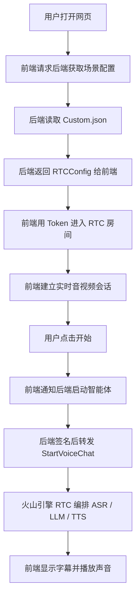

# RTC功能与项目结构介绍

这是一个基于火山引擎 RTC 的互动式语音客服 Demo。  
它不是“前端直接连一个大模型接口”那么简单，而是把网页、RTC 房间、ASR 语音识别、LLM 大模型和 TTS 语音合成串成一条完整链路。

如果你先想抓住主线，只要记住这三句话：

- **前端**负责页面、麦克风、摄像头、播放、RTC 房间连接
- **后端**负责读取配置、生成/校验 RTC 信息、做鉴权、转发“启动智能体”的请求
- **火山引擎云端**负责把 ASR、LLM、TTS 串起来完成实时语音对话

---

## 这项目里到底有哪些部分

### 前端

前端代码都在 `src/` 目录下，技术栈是 React + Redux + 火山引擎 RTC Web SDK。

前端主要做这些事：

- 打开网页，展示场景和对话界面
- 请求后端获取场景列表和 RTC 房间信息
- 用 RTC SDK 进入房间
- 打开麦克风、摄像头、屏幕共享
- 采集用户语音
- 播放 AI 返回的音频
- 显示字幕、对话内容、设备状态、房间状态
- 把“开始/停止智能体”的请求发给后端

前端关键文件：

- `src/index.tsx`：React 入口，挂载 Redux Provider
- `src/App.tsx`：页面路由入口
- `src/pages/MainPage/index.tsx`：主页面入口，启动时请求场景配置
- `src/pages/MainPage/MainArea/Antechamber/index.tsx`：进房前页面，点击开始加入 RTC
- `src/pages/MainPage/MainArea/Room/index.tsx`：进房后页面，显示房间、字幕、音视频和操作区
- `src/pages/MainPage/Menu/index.tsx`：右侧信息区，显示 AI 人设、版本、房间信息
- `src/lib/useCommon.ts`：封装了加入房间、设备权限、场景读取等 React hooks
- `src/lib/RtcClient.ts`：RTC 客户端封装，负责创建引擎、加入房间、采集音视频、发布流、启动/停止 AI
- `src/store/slices/room.ts`：房间状态、场景配置、RTC 配置、对话状态
- `src/store/slices/device.ts`：设备列表和设备权限状态
- `src/app/base.ts`：统一请求封装，前端通过它调用本地后端
- `src/app/api.ts`：定义前端要调用的接口
- `src/config/index.ts`：后端代理地址配置

### 后端

后端代码都在 `Server/` 目录下，技术栈是 Node.js + Koa。

后端主要做这些事：

- 读取 `Server/scenes/*.json`
- 把场景配置整理成前端需要的格式
- 如果 `RTCConfig` 缺少某些字段，自动补齐或生成
- 用 `AccountConfig` 里的 `AK/SK` 做签名鉴权
- 接收前端的 `StartVoiceChat` / `StopVoiceChat` 请求并转给火山引擎 RTC OpenAPI

后端关键文件：

- `Server/app.js`：核心后端入口，包含 `getScenes` 和 `proxy` 两个主要接口
- `Server/util.js`：通用工具，负责读取场景文件、统一返回格式、参数校验
- `Server/token.js`：RTC Token 生成逻辑
- `Server/scenes/Custom.json`：你需要填写的场景配置文件
- `Server/README.md`：后端单独的简要说明

### 其它 Python 目录

仓库里还有两个 Python 目录：

- `server_python/`
- `rag_llm_server/`

其中 `server_python/main.py` 可以理解成 Python/FastAPI 版后端。  
它和 `Server/app.js` 的核心职责很像，都是：

- 读取 `scenes` 场景配置
- 给前端返回 `getScenes`
- 接收 `StartVoiceChat` / `StopVoiceChat`
- 用 `AK/SK` 签名
- 转发给火山引擎 RTC OpenAPI

所以你可以把它们理解成“两套后端实现”：

- `Server/app.js`：Node.js 版后端
- `server_python/main.py`：Python/FastAPI 版后端

前端逻辑基本不用变，后端选一套跑就行，不需要两套同时启动。  
这个仓库默认的最短启动路径是 Node.js 版，也就是 `Server/app.js`。

`rag_llm_server/` 更偏扩展示例，用来演示自定义 LLM/RAG 回调链路。  
如果你的目标只是“网页先跑起来”，先重点看 `src/` 和 `Server/` 就够了。

---

## 先分清两种“交互”

很多人一开始会混淆“前端和 RTC 的交互”以及“后端和火山引擎 OpenAPI 的交互”。  
其实它们不是一回事。

### 1. 前端和 RTC SDK 的交互

这部分发生在浏览器里，前端会直接做这些事：

- 拿到 RTC `Token`
- 进入 RTC 房间
- 打开麦克风、摄像头
- 采集用户语音
- 播放 AI 返回的音频
- 监听房间里用户和设备状态变化
- 控制本地设备、字幕、全屏和房间状态

这部分代码主要在：

- [`src/lib/RtcClient.ts`](/Users/johnxu/Documents/project1学习/ark_aigc_demo/src/lib/RtcClient.ts)
- [`src/lib/useCommon.ts`](/Users/johnxu/Documents/project1学习/ark_aigc_demo/src/lib/useCommon.ts)

### 2. 后端和火山引擎 RTC OpenAPI 的交互

这部分不是浏览器直接做，而是由后端代替浏览器完成。  
当用户点击“开始”之后，前端会通知后端，后端再去调用火山引擎的 `StartVoiceChat` 接口。

后端会做这些事：

- 读取 `Server/scenes/Custom.json`
- 拿到 `AccountConfig` 里的 `AK/SK`
- 对 RTC OpenAPI 请求做签名
- 把 `StartVoiceChat` 或 `StopVoiceChat` 发给火山引擎

这部分代码主要在：

- [`Server/app.js`](/Users/johnxu/Documents/project1学习/ark_aigc_demo/Server/app.js)

### 3. 云端真正做什么

火山引擎云端负责的是：

- ASR：把你说的话转成文字
- LLM：根据文字生成回答
- TTS：把回答再合成语音

所以你可以这样记：

- **前端**负责“人和房间怎么连”
- **后端**负责“怎么安全地把启动请求送到云端”
- **云端**负责“智能客服真正回答你”

### 一个更小的文字流程图

```text
用户
  ↓
前端网页
  ↓ 请求 getScenes
后端 Node 服务
  ↓ 读取 Custom.json
RTC 房间配置返回给前端
  ↓
前端 RTC SDK 进房间
  ↓ 点击开始
前端把启动请求发给后端
  ↓
后端用 AK/SK 转发到火山引擎 RTC OpenAPI
  ↓
火山引擎 RTC / ASR / LLM / TTS
  ↓
前端显示字幕并播放声音
```

### 房间是固定还是动态

这个 Demo 里，房间信息既可以写死，也可以让后端动态生成。

- **写死**：适合本地测试，大家都用同一个 `RoomId` 和 `UserId`
- **动态生成**：适合多人访问，每次新进来的人拿到新的 `RoomId` / `UserId` / `Token`

你可以这样理解：

- `RoomId` 是房间号
- `UserId` 是进房的人
- `Token` 是进房门票

如果所有人都用同一个 `RoomId`，就会进到同一个房间里。  
所以：

- **本地跑通 Demo** 可以先写死
- **正式上线多人使用** 应该让后端给每个人生成新的房间信息

这个项目的后端会在 `getScenes` 里检查这些值：

- 如果 `RoomId`、`UserId`、`Token` 没填
- 就会自动生成
- 再把新的值返回给前端

所以你可以把它记成：

- **房间规则放在 JSON 里**
- **房间编号和门票可以由后端动态生成**

---

## 整体业务流程

这个 Demo 的主流程可以分成 10 步：

1. 用户打开网页
2. 前端先请求后端的 `getScenes`
3. 后端读取 `Server/scenes/Custom.json`
4. 后端把场景配置和 RTC 房间信息返回给前端
5. 前端拿到 `RTCConfig`，用 RTC SDK 进入房间
6. 用户点击“开始”
7. 前端把“启动智能体”请求发给后端
8. 后端用 `AK/SK` 签名后，把请求转给火山引擎 RTC OpenAPI
9. 火山引擎 RTC 按 `VoiceChat` 的配置串起 ASR、LLM、TTS
10. 前端继续显示字幕、播放声音、更新状态

### 一张最好记的流程图



### 为什么不是“前端直接调一个普通 API”

因为 RTC 不是普通的 HTTP 请求-响应接口，它还要和浏览器的实时媒体能力绑定：

- 浏览器要直接拿麦克风和扬声器
- 浏览器要处理实时音视频流
- 浏览器要维护长连接和设备状态
- 浏览器要显示字幕、房间状态和对话状态

这些动作天然发生在前端，所以 RTC 的实时会话一定要由前端来做。  
而后端最适合做的是：

- 保存和读取配置
- 保护密钥，不把 `AK/SK` 暴露给浏览器
- 给 RTC/OpenAPI 做签名
- 发起 `StartVoiceChat` / `StopVoiceChat`

你可以把它记成：

- **前端管“实时会话和设备交互”**
- **后端管“安全鉴权和启动请求转发”**

---

## 配置文件怎么分

`Server/scenes/Custom.json` 里主要分三块：

- `AccountConfig`：火山引擎 IAM 的 `AK/SK`，给后端签名调用 OpenAPI 用
- `RTCConfig`：网页进 RTC 房间要用的信息，包括 `AppId`、`RoomId`、`UserId`、`Token`
- `VoiceChat`：启动智能体时要下发给 RTC AIGC 服务的完整配置，包括 `ASRConfig`、`TTSConfig`、`LLMConfig`

最容易混的点：

- `AccountConfig` 不是 LLM 的 key
- `RTCConfig` 不是模型配置
- `VoiceChat.LLMConfig.EndPointId` 才是你在火山方舟里创建的推理接入点 ID

---

## 快速开始

### 1. 启动后端

进入项目根目录后：

```bash
cd Server
yarn
yarn dev
```

### 2. 启动前端

回到项目根目录后：

```bash
yarn
yarn dev
```

### 3. 填写场景配置

先把 `Server/scenes/Custom.json` 填好，至少要有：

- `AccountConfig.accessKeyId`
- `AccountConfig.secretKey`
- `RTCConfig.AppId`
- `RTCConfig.AppKey` 或者可由后端自动生成 Token 的必要信息
- `VoiceChat.AppId`
- `VoiceChat.AgentConfig.TargetUserId[0]`
- `VoiceChat.Config.ASRConfig.ProviderParams.AppId`
- `VoiceChat.Config.TTSConfig.ProviderParams.app.appid`
- `VoiceChat.Config.LLMConfig.EndPointId`

如果你已经拿到控制台里的参数，把它们写进同一个 `Custom.json` 就行。  
后端会读取这份文件，前端也会从后端拿到同一份场景信息。

---

## 常见问题

- **启动后一直卡在“AI 准备中”**
  - 检查相关服务是否已开通
  - 检查 `AK/SK`、`RTC AppId/AppKey`、`LLM EndpointId`、`ASR/TTS AppId` 是否填写正确
  - 检查房间是否已经有旧任务没挂断

- **浏览器提示 `token_error`**
  - 检查 `RTCConfig.Token` 是否合法
  - 检查 `RoomId`、`UserId` 是否和生成 Token 时保持一致

- **麦克风或摄像头打不开**
  - 检查页面是否在 `localhost` 或 HTTPS 下运行
  - 检查浏览器权限是否已经允许

- **`Invalid 'Authorization' header`**
  - 通常是 `Server/scenes/Custom.json` 里的 `AccountConfig.accessKeyId` 或 `secretKey` 不正确

- **`[StartVoiceChat]Failed`**
  - 如果 `RoomId`、`UserId` 是固定值，重复启动前要先 `StopVoiceChat`

---

## 代码阅读顺序建议

如果你想快速读懂代码，建议按这个顺序：

1. 先看 `src/pages/MainPage/index.tsx`
2. 再看 `src/lib/useCommon.ts`
3. 再看 `src/lib/RtcClient.ts`
4. 然后看 `Server/app.js`
5. 最后看 `Server/scenes/Custom.json`

这样你会先理解“页面怎么动”，再理解“前端怎么连房间”，然后理解“后端怎么转发”，最后理解“配置怎么填”。

---

## 更新日志

### 1.6.0

- 更新 RTC Web SDK 版本
- 简化 Demo 使用方式
- 统一场景配置方式
- 增强后端参数校验和 Token 生成能力
- 追加服务端 README

---

## Scenes 解读

这一节专门解释项目里的 `scene / scenes / SceneID / updateScene` 是什么。新手可以先记住一句话：

**Scene 就是一套“AI 语音客服怎么工作”的配置。**

它不是一个页面，也不是一个模型，而是把下面这些东西打包到一起：

- 前端要展示什么名字、头像、模式
- 用户要进入哪个 RTC 房间
- AI 智能体叫什么、欢迎语是什么
- 用哪个 ASR 把语音转成文字
- 用哪个 LLM 大模型回答问题
- 用哪个 TTS 把文字转成声音
- 后端用哪个 AK/SK 去请求火山引擎 OpenAPI

### 当前项目有几个 Scene

目前主 Demo 里真正可用的场景配置只有一个：

```text
Server/scenes/Custom.json
```

也就是说，当前项目启动后，后端读取到的场景列表只有：

```text
Custom
```

项目里虽然有很多 `scene` 相关代码，但它们大多数是在“支持多个场景”的能力，不代表现在已经有多个场景文件。

### Scene 文件在哪里

主后端读取的是这个目录：

```text
Server/scenes/
```

现在里面只有：

```text
Custom.json
```

如果以后你想加第二个场景，可以新增：

```text
Server/scenes/CourseConsultant.json
Server/scenes/AfterSales.json
Server/scenes/InterviewCoach.json
```

文件名会变成场景 ID。

比如：

```text
Custom.json             -> SceneID 是 Custom
CourseConsultant.json   -> SceneID 是 CourseConsultant
AfterSales.json         -> SceneID 是 AfterSales
```

### Custom.json 里面主要有什么

`Server/scenes/Custom.json` 主要分成四块：

```text
AccountConfig
RTCConfig
SceneConfig
VoiceChat
```

含义如下：

| 配置块 | 给谁用 | 作用 |
| --- | --- | --- |
| `AccountConfig` | 后端用 | 放火山引擎 AK/SK，后端调用 OpenAPI 时用来签名 |
| `RTCConfig` | 前端用 | 告诉前端进哪个 RTC 房间，用哪个用户 ID 和 Token |
| `SceneConfig` | 前端用 | 控制页面展示，比如场景名、头像模式、视觉模式等 |
| `VoiceChat` | 后端传给火山引擎 | 启动 AI 智能体，配置 ASR、LLM、TTS、欢迎语、人设等 |

### 可以扩展什么

扩展 Scene，本质就是新增或修改一套客服“剧本”。

你可以扩展这些东西：

- **换客服人设**：比如课程顾问、售后客服、面试陪练、英语老师
- **换欢迎语**：比如“你好，我是 AI 课程顾问”
- **换大模型**：修改 `VoiceChat.Config.LLMConfig.EndPointId`
- **换声音**：修改 `VoiceChat.Config.TTSConfig`
- **换语音识别服务**：修改 `VoiceChat.Config.ASRConfig`
- **换 RTC 房间**：修改 `RTCConfig.RoomId`、`UserId`、`Token`
- **加多个业务场景**：在 `Server/scenes/` 下新增多个 `.json` 文件

### Scene 的整体流转

可以把它想成下面这条线：

```text
Server/scenes/Custom.json
        ↓
后端 Server/app.js 启动时读取 scenes 文件夹
        ↓
前端打开页面，请求 /getScenes
        ↓
后端把 scenes 列表返回给前端
        ↓
前端默认选择第一个 scene，也就是 Custom
        ↓
前端根据 RTCConfig 进入 RTC 房间
        ↓
用户点击开始
        ↓
前端把当前 SceneID 发给后端
        ↓
后端找到对应的 Custom.json
        ↓
后端把 VoiceChat 配置提交给火山引擎
        ↓
火山引擎创建 AI Agent 进入同一个 RTC 房间
        ↓
用户和 AI Agent 在 RTC 房间里实时语音对话
```

### getScenes 是干什么的

`getScenes` 是前端打开页面后调用的第一个核心接口。

代码位置：

```text
Server/app.js
src/pages/MainPage/index.tsx
```

它做的事情很简单：

```text
前端：我要知道有哪些场景
  ↓
后端：我去 Server/scenes/ 下面读取所有 json
  ↓
后端：整理成 scenes 数组
  ↓
前端：保存场景信息和 RTC 房间信息
```

当前因为只有 `Custom.json`，所以 `getScenes` 返回的 scenes 数组里也只有一个场景。

### updateScene 是什么意思

`updateScene` 不是去修改服务器上的 `Custom.json` 文件。

它只是前端 Redux 里的一个状态更新函数。

代码位置：

```text
src/store/slices/room.ts
```

它的含义是：

```text
把“当前正在使用哪个场景”记到前端状态里
```

比如当前只有一个场景时：

```text
updateScene("Custom")
```

意思就是：

```text
当前页面正在使用 Custom 这个场景
```

如果以后有多个场景，比如：

```text
Custom
CourseConsultant
AfterSales
```

那 `updateScene("AfterSales")` 的意思就是：

```text
用户当前切换到了售后客服场景
```

### 更新 Scene 的业务逻辑是什么

项目里有两种“更新 Scene”，意思不一样：

第一种是**开发者更新配置文件**：

```text
你手动修改 Server/scenes/Custom.json
```

这是真正修改 AI 客服配置，比如改模型、改声音、改欢迎语。

第二种是**前端更新当前选中的场景**：

```text
dispatch(updateScene("Custom"))
```

这只是告诉页面：

```text
现在用哪个场景
```

它不会改 JSON 文件，也不会改火山引擎后台。

### 前端为什么要保存 Scene

因为前端后面做很多事情都要知道“当前场景是谁”：

- 显示当前 AI 名字
- 显示当前场景的头像和 UI 状态
- 找到当前场景对应的 RTC 房间信息
- 点击开始时，把当前 `SceneID` 发给后端
- 点击停止时，把当前 `SceneID` 发给后端

所以前端需要记住：

```text
当前 scene = Custom
```

### 多场景时会发生什么

如果 `Server/scenes/` 下有多个 json：

```text
Custom.json
CourseConsultant.json
AfterSales.json
```

后端 `getScenes` 会返回三个场景。

前端会把它们整理成两个 map：

```text
sceneConfigMap
rtcConfigMap
```

大概意思是：

```text
sceneConfigMap["Custom"] = Custom 的页面配置
rtcConfigMap["Custom"] = Custom 的 RTC 房间配置

sceneConfigMap["AfterSales"] = AfterSales 的页面配置
rtcConfigMap["AfterSales"] = AfterSales 的 RTC 房间配置
```

以后用户切换场景时，前端只要更新：

```text
scene = "AfterSales"
```

就知道该用哪一套页面配置和 RTC 配置。

### 当前 Demo 要注意什么

当前 Demo 适合本地学习，所以只有一个固定场景：

```text
Custom
```

这对本地跑通完全没问题。

但是如果以后真的上线给多人使用，就不能所有人都用同一个固定 `RoomId`。

否则可能出现：

```text
用户 A 进了 ChatRoom01
用户 B 也进了 ChatRoom01
AI Agent 也在 ChatRoom01
```

这样多个用户就会挤进同一个房间。

正式业务里通常要做到：

```text
每个用户会话生成一个新的 RoomId
每个用户生成一个新的 UserId
每次会话生成新的 Token
```

本 Demo 已经预留了自动生成 RoomId、UserId、Token 的逻辑，但需要 `RTCConfig.AppKey` 存在。

### 最后记忆版

如果你困了，只记这几句：

```text
Scene = 一套 AI 语音客服配置
Custom.json = 当前唯一的 Scene
getScenes = 后端把 Scene 列表给前端
updateScene = 前端记住当前选中了哪个 Scene
SceneID = 前端告诉后端“我要启动哪个配置”
VoiceChat = 后端交给火山引擎启动 AI Agent 的配置
```

---

## useJoin 解读

`useJoin` 是这个项目里很重要的一个前端 Hook。

代码位置：

```text
src/lib/useCommon.ts
```

它可以理解成：

```text
用户点击“开始体验 / 进入房间”之后，真正执行主流程的地方
```

一句话：

```text
useJoin = 进 RTC 房间 + 开麦克风 + 启动 AI Agent
```

### useJoin 返回什么

`useJoin` 最后返回了两个东西：

```ts
return [joining, disPatchJoin];
```

含义是：

```text
joining = 当前是否正在加入房间
disPatchJoin = 真正执行“加入房间”的函数
```

页面里这样接收：

```ts
const [joining, dispatchJoin] = useJoin();
```

这句可以读成：

```text
从 useJoin 里面拿到两个东西：
1. joining：按钮是否显示加载中
2. dispatchJoin：点击按钮时要执行的方法
```

### 页面怎么使用 useJoin

使用位置：

```text
src/pages/MainPage/MainArea/Antechamber/index.tsx
```

大概逻辑是：

```text
按钮 loading 使用 joining
按钮 onClick 使用 dispatchJoin
```

也就是：

```text
joining 控制按钮是不是转圈
dispatchJoin 控制点击后真正开始进入房间
```

这里有一个很容易绕的点：

```text
dispatchJoin 是 useJoin 返回出来的函数
但它不是返回之后马上自动执行
```

它的完整关系是：

```text
useJoin 里面创建了一个函数：disPatchJoin
        ↓
useJoin 把这个函数 return 出去
        ↓
页面用 const [joining, dispatchJoin] = useJoin() 接住它
        ↓
页面把 dispatchJoin 绑定到按钮 onClick 上
        ↓
用户点击按钮
        ↓
React 执行 dispatchJoin()
        ↓
才真正开始：进房间、开麦、启动 AI
```

所以可以这样理解：

```text
useJoin 返回的是“按钮要执行的功能”
按钮被点击时，这个功能才真正执行
```

类比一下：

```text
useJoin 返回了一把钥匙
页面把这把钥匙挂到按钮上
用户点击按钮时，才用这把钥匙开门
```

### 点击按钮后的核心链路

用户点击按钮后，会执行：

```text
dispatchJoin()
```

然后进入 `useJoin` 里面的 `disPatchJoin` 函数。

核心流程是：

```text
用户点击开始
  ↓
执行 dispatchJoin
  ↓
检查浏览器是否支持 RTC
  ↓
设置 joining = true，按钮进入加载状态
  ↓
创建 RTC 引擎
  ↓
注册 RTC 事件监听
  ↓
用户加入 RTC 房间
  ↓
获取麦克风设备
  ↓
把“用户已进房间”写入前端状态
  ↓
如果有麦克风权限，打开麦克风
  ↓
启动 AI Agent
```

对应到关键代码可以记这几句：

```ts
await RtcClient.createEngine();
```

创建 RTC 引擎。

```ts
RtcClient.addEventListeners(listeners);
```

注册 RTC 事件监听。

```ts
await RtcClient.joinRoom();
```

用户自己进入 RTC 房间。

```ts
await switchMic();
```

打开麦克风。

```ts
handleAIGCModeStart();
```

启动 AI Agent。

### AI Agent 是在哪里启动的

`useJoin` 里面有一个内部函数：

```ts
const handleAIGCModeStart = async () => {
  if (room.isAIGCEnable) {
    await RtcClient.stopAgent(id);
    dispatch(clearCurrentMsg());
    await RtcClient.startAgent(id);
  } else {
    await RtcClient.startAgent(id);
  }
  dispatch(updateAIGCState({ isAIGCEnable: true }));
};
```

它的作用是：

```text
如果 AI 已经启动，就先停掉再重新启动
如果 AI 没启动，就直接启动
最后把前端状态改成：AI 已经启动
```

其中最核心的是：

```ts
await RtcClient.startAgent(id);
```

这里的 `id` 就是当前 Scene 的 ID。

当前项目里通常就是：

```text
Custom
```

所以可以理解为：

```text
启动 Custom 这个场景对应的 AI Agent
```

### useJoin 和 Scene 的关系

`useJoin` 里会拿当前场景：

```ts
const { id } = useScene();
```

意思是：

```text
从前端状态里拿到当前选中的 scene id
```

然后启动 AI 时会传进去：

```text
RtcClient.startAgent(id)
```

继续往下：

```text
RtcClient.startAgent("Custom")
  ↓
Apis.VoiceChat.StartVoiceChat({ SceneID: "Custom" })
  ↓
请求后端 /proxy?Action=StartVoiceChat
  ↓
后端根据 SceneID 找到 Server/scenes/Custom.json
  ↓
后端把 VoiceChat 配置交给火山引擎
  ↓
火山引擎创建 AI Agent 进入 RTC 房间
```

### 最后记忆版

如果只记主线：

```text
useJoin 返回 [joining, dispatchJoin]

joining = 控制按钮加载状态
dispatchJoin = 点击后执行加入房间流程

dispatchJoin 做三件核心事：
1. 用户进入 RTC 房间
2. 用户打开麦克风
3. 启动 AI Agent
```

---

## RtcClient 解读

`RtcClient` 是理解前端 RTC 主流程时非常重要的一个文件。

代码位置：

```text
src/lib/RtcClient.ts
```

一句话：

```text
RtcClient = 前端封装出来的 RTC 操作中心
```

它不是后端，也不是火山引擎服务本身。

它是前端代码里专门负责和火山引擎 RTC SDK 打交道的“工具对象”。

### RtcClient 是什么角色

可以这样理解：

```text
useJoin = 组织流程的人
RtcClient = 真正执行 RTC 动作的人
```

比如：

```text
useJoin 决定：现在该进房间了
  ↓
RtcClient.joinRoom() 真正去进 RTC 房间

useJoin 决定：现在该启动 AI 了
  ↓
RtcClient.startAgent(scene) 真正去发启动请求
```

更短一点：

```text
useJoin 负责“什么时候做”
RtcClient 负责“具体怎么做”
```

### RtcClient 主要负责什么

它主要负责这些事情：

```text
创建 RTC 引擎
注册 RTC 事件监听
进入 RTC 房间
离开 RTC 房间
打开 / 关闭麦克风
打开 / 关闭摄像头
发布 / 取消发布音视频流
启动 AI Agent
停止 AI Agent
给 AI Agent 发送控制命令
```

所以，凡是你看到项目里出现：

```text
RtcClient.xxx()
```

大概率就是前端正在执行某个 RTC 相关动作。

### RtcClient 和 useJoin 的关系

`useJoin` 里会调用多个 `RtcClient` 方法。

核心链路是：

```text
用户点击开始按钮
  ↓
useJoin 返回的 dispatchJoin 被执行
  ↓
RtcClient.createEngine()
  ↓
RtcClient.addEventListeners(...)
  ↓
RtcClient.joinRoom()
  ↓
switchMic()
  ↓
RtcClient.startAgent(scene)
```

也就是说：

```text
useJoin 是主流程入口
RtcClient 是主流程里的执行工具
```

### createEngine 是干什么的

```ts
await RtcClient.createEngine();
```

作用是：

```text
创建火山引擎 RTC SDK 的 engine
```

可以把 `engine` 理解成：

```text
前端连接 RTC 房间的核心实例
```

没有它，后面就不能进房间、发布音频、监听远端用户。

### addEventListeners 是干什么的

```ts
RtcClient.addEventListeners(listeners);
```

作用是：

```text
注册 RTC 事件监听
```

比如监听：

```text
有人进房间了
有人离开房间了
远端用户发布了音频
远端用户取消发布音频
网络质量变化
收到 RTC 消息
自动播放失败
```

可以理解成：

```text
告诉前端：房间里发生事情时，你要怎么反应
```

这里的 `listeners` 来自：

```text
src/lib/listenerHooks.ts
```

`listenerHooks.ts` 可以理解成：

```text
RTC 房间事件监听器集合
```

它主要负责：

```text
监听 RTC 房间里发生的事情
然后 dispatch 更新 Redux 状态
最后让页面 UI 跟着变化
```

比如：

```text
有人进房间了        -> 更新远端用户列表
有人离开房间        -> 移除远端用户
AI 发布音频流        -> 页面知道 AI 开始说话
AI 停止发布音频流    -> 页面知道 AI 停止说话
网络质量变化        -> 更新信号状态
收到 AI 消息/字幕    -> 解析消息并更新字幕
```

所以它和 `RtcClient` 的关系是：

```text
RtcClient.addEventListeners(listeners)
        ↓
把 listenerHooks 里准备好的监听函数注册到 RTC SDK 上
        ↓
以后 RTC 房间有变化时，这些函数会被自动触发
        ↓
函数里面 dispatch 更新 Redux
        ↓
页面 UI 跟着刷新
```

一句话：

```text
RtcClient 负责连接和操作 RTC
listenerHooks 负责接收 RTC 事件并推动 UI 更新
```

### joinRoom 是干什么的

```ts
await RtcClient.joinRoom();
```

作用是：

```text
让当前网页用户进入 RTC 房间
```

它会用到前面从 `getScenes` 拿到的 RTC 配置：

```text
AppId
RoomId
UserId
Token
```

链路是：

```text
getScenes 返回 RTCConfig
  ↓
前端保存 RTCConfig
  ↓
updateRTCConfig 把配置写到 RtcClient.basicInfo
  ↓
RtcClient.joinRoom 使用 basicInfo 进房间
```

### startAgent 是干什么的

```ts
await RtcClient.startAgent(scene);
```

作用是：

```text
启动当前 scene 对应的 AI Agent
```

它内部会调用：

```ts
await Apis.VoiceChat.StartVoiceChat({
  SceneID: scene,
});
```

也就是：

```text
前端把 SceneID 发给后端
```

完整链路：

```text
RtcClient.startAgent("Custom")
  ↓
Apis.VoiceChat.StartVoiceChat({ SceneID: "Custom" })
  ↓
请求后端 /proxy?Action=StartVoiceChat
  ↓
后端读取 Server/scenes/Custom.json
  ↓
后端拿 VoiceChat 配置请求火山引擎
  ↓
火山引擎创建 AI Agent
  ↓
AI Agent 进入 RTC 房间
```

### stopAgent 是干什么的

```ts
await RtcClient.stopAgent(scene);
```

作用是：

```text
停止当前 scene 对应的 AI Agent
```

它内部会调用：

```ts
await Apis.VoiceChat.StopVoiceChat({
  SceneID: scene,
});
```

完整链路：

```text
RtcClient.stopAgent("Custom")
  ↓
Apis.VoiceChat.StopVoiceChat({ SceneID: "Custom" })
  ↓
请求后端 /proxy?Action=StopVoiceChat
  ↓
后端读取 Server/scenes/Custom.json
  ↓
后端拿 AppId / RoomId / TaskId 请求火山引擎
  ↓
火山引擎停止 AI Agent
```

### RtcClient 和后端的关系

`RtcClient` 里面有两类动作：

第一类是**直接操作 RTC SDK**：

```text
createEngine
joinRoom
leaveRoom
startAudioCapture
publishStream
```

这些主要是：

```text
前端直接和 RTC 房间交互
```

第二类是**请求后端接口**：

```text
startAgent
stopAgent
```

这些主要是：

```text
前端让后端帮忙启动 / 停止 AI Agent
```

所以它刚好连接了两条线：

```text
前端页面
  ↓
RtcClient
  ↓
RTC SDK 进入房间

前端页面
  ↓
RtcClient
  ↓
Apis
  ↓
后端
  ↓
火山引擎 OpenAPI 启动 AI Agent
```

### 最后记忆版

如果只记最核心的：

```text
RtcClient = 前端 RTC 操作中心

useJoin 调度流程
RtcClient 执行动作

joinRoom = 用户进 RTC 房间
startAgent = 启动 AI Agent
stopAgent = 停止 AI Agent
```

---

## Hook 合集

这一节专门整理项目里常见的 Hook。

新手可以先记住：

```text
Hook = React 函数组件里用来“拿能力”的函数
```

比如：

```text
useState     挂载一个状态能力
useEffect    挂载一个副作用能力，比如页面加载后请求数据
useSelector  挂载读取 Redux 状态的能力
useDispatch  挂载修改 Redux 状态的能力
useJoin      项目自己封装的“加入房间能力”
```

### Hook 分成几类

这个项目里主要有三类 Hook：

```text
React 官方 Hook
Redux 提供的 Hook
项目自己封装的 Hook
```

对应关系是：

| Hook | 来源 | 作用 |
| --- | --- | --- |
| `useState` | React 官方 | 在组件里保存一个局部状态 |
| `useEffect` | React 官方 | 在页面加载、状态变化时执行一些逻辑 |
| `useSelector` | react-redux | 从 Redux 全局状态里读取数据 |
| `useDispatch` | react-redux | 向 Redux 发命令，修改全局状态 |
| `useJoin` | 项目自定义 | 封装“进入房间 + 开麦 + 启动 AI Agent”的主流程 |

### useState

`useState` 用来保存组件自己的状态。

比如 `useJoin` 里有：

```ts
const [joining, setJoining] = useState(false);
```

意思是：

```text
joining = 当前是否正在加入房间
setJoining = 修改 joining 的方法
false = 初始状态是不在加入中
```

在业务链路里，它主要控制按钮加载状态：

```text
用户点击开始
  ↓
setJoining(true)
  ↓
按钮显示加载中
  ↓
加入房间完成
  ↓
setJoining(false)
  ↓
按钮取消加载
```

### useEffect

`useEffect` 用来处理“页面出现后要做的事”。

比如主页面里：

```ts
useEffect(() => {
  getScenes();
}, []);
```

意思是：

```text
页面加载后，调用 getScenes
```

在这个项目里的主链路是：

```text
用户打开网页
  ↓
useEffect 触发
  ↓
调用 getScenes
  ↓
前端请求后端 /getScenes
  ↓
后端返回 scenes
  ↓
前端保存 sceneConfig 和 rtcConfig
```

所以 `useEffect` 在这里负责：

```text
页面一进来，自动把场景配置拉回来
```

### useSelector

`useSelector` 用来从 Redux 全局状态里读数据。

比如：

```ts
const room = useSelector((state: RootState) => state.room);
```

意思是：

```text
从全局状态里拿 room 这一块数据
```

在这个项目里，经常用它拿：

```text
当前 scene
当前 rtcConfigMap
当前 sceneConfigMap
当前是否已经进房间
当前麦克风/摄像头状态
```

业务链路里它负责“读取当前情况”：

```text
组件想知道当前选中哪个场景
  ↓
useSelector 读取 state.room.scene
  ↓
组件根据当前 scene 展示 UI 或启动对应 Agent
```

### useDispatch

`useDispatch` 用来拿到一个 `dispatch` 方法。

`dispatch` 可以理解成：

```text
向 Redux 发一个修改状态的命令
```

比如：

```ts
dispatch(updateScene(scenes[0].scene.id));
```

意思是：

```text
把当前选中的 scene 改成后端返回的第一个场景
```

再比如：

```ts
dispatch(updateAIGCState({ isAIGCEnable: true }));
```

意思是：

```text
把前端状态改成：AI Agent 已经启动
```

业务链路里它负责“更新当前情况”：

```text
后端返回 scenes
  ↓
dispatch(updateSceneConfig(...))
  ↓
Redux 保存所有场景配置

用户进入房间
  ↓
dispatch(localJoinRoom(...))
  ↓
Redux 保存当前用户已进房

AI 启动成功
  ↓
dispatch(updateAIGCState(...))
  ↓
Redux 保存 AI 已启动
```

### useJoin

`useJoin` 是项目自己封装的 Hook。

它把很多业务步骤包成一个按钮可以调用的方法。

它返回：

```ts
return [joining, disPatchJoin];
```

页面接收：

```ts
const [joining, dispatchJoin] = useJoin();
```

按钮使用：

```text
loading 使用 joining
onClick 使用 dispatchJoin
```

它的核心链路是：

```text
用户点击开始按钮
  ↓
执行 dispatchJoin
  ↓
检查浏览器是否支持 RTC
  ↓
创建 RTC 引擎
  ↓
注册 RTC 事件监听
  ↓
用户加入 RTC 房间
  ↓
获取麦克风设备
  ↓
更新 Redux：用户已经进房间
  ↓
打开麦克风
  ↓
启动 AI Agent
  ↓
更新 Redux：AI 已启动
```

### Hook 在本项目主链路里的位置

把它们串起来看：

```text
页面加载
  ↓
useEffect 调 getScenes
  ↓
useDispatch 把 scenes 保存到 Redux
  ↓
useSelector 读取当前 scene / rtcConfig
  ↓
用户点击开始按钮
  ↓
useJoin 返回的 dispatchJoin 被执行
  ↓
useState 控制按钮 loading
  ↓
RtcClient.joinRoom 进入 RTC 房间
  ↓
RtcClient.startAgent 启动 AI Agent
  ↓
useDispatch 更新 AI 已启动状态
  ↓
useSelector 读取新状态，页面跟着刷新
```

### 最后记忆版

如果只记最核心的：

```text
useState = 组件自己的小状态
useEffect = 页面加载后自动做事
useSelector = 从 Redux 读状态
useDispatch = 往 Redux 改状态
useJoin = 把“进入房间并启动 AI”的业务流程封装起来
```

---

## 语音链路五问

这一节回答五个最核心的问题：

```text
1. 我开始说话了，麦克风采集声音是在哪？
2. 我说完话后，发给 AI 的声音在哪？
3. 我说完话，我的字幕展示在屏幕上，这个文字消息从哪来？
4. AI 的回复文字从哪里来？
5. AI 回复的语音从哪里来？
```

先看总链路：

```text
用户点击开始
  ↓
useJoin
  ↓
RtcClient.joinRoom 进入 RTC 房间
  ↓
switchMic 打开麦克风
  ↓
RtcClient.startAudioCapture 开始采集麦克风声音
  ↓
RtcClient.publishStream 把声音发布到 RTC 房间
  ↓
火山引擎 RTC 房间里的 AI Agent 收到用户声音
  ↓
AI Agent 使用 ASR 把声音转文字
  ↓
AI Agent 使用 LLM 生成回复文字
  ↓
AI Agent 使用 TTS 生成回复语音
  ↓
AI Agent 把字幕/状态通过 RTC 消息发回前端
  ↓
AI Agent 把语音作为远端音频流发回前端
  ↓
前端展示字幕并播放 AI 语音
```

### 1. 我开始说话了，麦克风采集声音是在哪

相关代码：

```text
src/lib/useCommon.ts
src/lib/RtcClient.ts
```

核心入口在 `useJoin` 里：

```text
用户点击开始
  ↓
dispatchJoin
  ↓
如果有麦克风权限
  ↓
switchMic()
```

`switchMic` 里面会调用：

```ts
await RtcClient.startAudioCapture();
```

然后到 `RtcClient.ts` 里：

```ts
startAudioCapture = async (mic?: string) => {
  await this.engine.startAudioCapture(mic || this._audioCaptureDevice);
};
```

意思是：

```text
调用火山 RTC SDK，开始采集本机麦克风声音
```

所以答案是：

```text
麦克风采集发生在前端 RtcClient.startAudioCapture()
底层真正采集声音的是火山引擎 RTC SDK
```

### 2. 我说完话后，发给 AI 的声音在哪

相关代码：

```text
src/lib/useCommon.ts
src/lib/RtcClient.ts
```

打开麦克风时，`switchMic` 还会调用：

```ts
RtcClient.publishStream(MediaType.AUDIO)
```

到 `RtcClient.ts` 里：

```ts
publishStream = (mediaType: MediaType) => {
  this.engine.publishStream(mediaType);
};
```

意思是：

```text
把本地采集到的音频发布到 RTC 房间
```

注意这里不是前端把声音通过普通 HTTP 接口发给后端。

真实链路是：

```text
浏览器麦克风
  ↓
RTC SDK 采集声音
  ↓
RTC SDK 把音频流发布到 RTC 房间
  ↓
AI Agent 也在同一个 RTC 房间里
  ↓
AI Agent 听到用户的音频流
```

所以答案是：

```text
用户声音是通过 RTC 音频流发给同一个房间里的 AI Agent
不是通过 /proxy 发给后端
```

### 3. 我说完话，我的字幕展示在屏幕上，这个文字消息从哪来

用户字幕不是前端自己识别出来的。

它来自火山引擎 AI Agent 回传的字幕消息。

相关代码：

```text
src/lib/listenerHooks.ts
src/utils/handler.ts
src/store/slices/room.ts
src/pages/MainPage/MainArea/Room/Conversation.tsx
```

链路是：

```text
用户声音进入 RTC 房间
  ↓
AI Agent 听到用户声音
  ↓
ASR 把用户声音转成文字
  ↓
AI Agent 通过 RTC 二进制消息把字幕发回前端
  ↓
listenerHooks 收到消息
  ↓
handler.ts 解析消息
  ↓
Redux 保存到 msgHistory
  ↓
Conversation.tsx 从 msgHistory 读取并展示
```

接收 RTC 消息的位置：

```ts
const handleRoomBinaryMessageReceived = (event) => {
  parser(message);
};
```

这个方法是一个 RTC 监听回调。

它在 `RtcClient.addEventListeners` 里注册到 RTC SDK：

```ts
this.engine.on(
  VERTC.events.onRoomBinaryMessageReceived,
  handleRoomBinaryMessageReceived
);
```

所以用户字幕链路可以记成：

```text
AI Agent 发回字幕消息
  ↓
RTC SDK 触发 onRoomBinaryMessageReceived
  ↓
handleRoomBinaryMessageReceived 接住消息
  ↓
parser 解析消息
  ↓
setHistoryMsg 写入 Redux
  ↓
Conversation.tsx 展示字幕
```

解析字幕的位置：

```ts
[MESSAGE_TYPE.SUBTITLE]: (parsed) => {
  dispatch(setHistoryMsg(...));
}
```

展示字幕的位置：

```text
Conversation.tsx 读取 room.msgHistory
```

所以答案是：

```text
我的字幕来自 AI Agent 回传的 ASR 识别结果
前端只是接收、保存、展示
```

### 4. AI 的回复文字从哪里来

AI 回复文字也不是前端生成的。

它来自云端 AI Agent 里的 LLM。

配置在：

```text
Server/scenes/Custom.json
```

里面的核心配置是：

```text
VoiceChat.Config.LLMConfig
```

业务链路是：

```text
AI Agent 收到用户声音
  ↓
ASR 把用户声音转成文字
  ↓
LLM 根据用户文字和 SystemMessages 生成回复
  ↓
AI Agent 把回复文字通过字幕消息发回前端
  ↓
前端 listenerHooks 收到
  ↓
handler.ts 解析
  ↓
setHistoryMsg 写入 Redux
  ↓
Conversation.tsx 展示
```

AI 回复文字走的也是这个监听回调：

```text
onRoomBinaryMessageReceived
  ↓
handleRoomBinaryMessageReceived
  ↓
parser
  ↓
MESSAGE_TYPE.SUBTITLE
  ↓
setHistoryMsg
```

区别只是：

```text
用户字幕 = ASR 识别用户声音后回传
AI 字幕 = LLM 生成回复文字后回传
```

所以答案是：

```text
AI 回复文字来自火山引擎云端 Agent 调用 LLM 后的结果
前端不负责生成 AI 回复
```

### 5. AI 回复的语音从哪里来

AI 回复语音来自云端 AI Agent 的 TTS。

配置在：

```text
Server/scenes/Custom.json
```

里面的核心配置是：

```text
VoiceChat.Config.TTSConfig
```

业务链路是：

```text
LLM 生成 AI 回复文字
  ↓
TTS 把回复文字转成语音
  ↓
AI Agent 在 RTC 房间里发布自己的音频流
  ↓
前端 RTC SDK 自动订阅远端音频
  ↓
浏览器播放 AI 的声音
```

前端监听到远端用户发布音频流的位置：

```text
src/lib/listenerHooks.ts
```

对应逻辑：

```ts
handleUserPublishStream
```

这个方法也是 RTC 监听回调。

它在 `RtcClient.addEventListeners` 里注册到 RTC SDK：

```ts
this.engine.on(
  VERTC.events.onUserPublishStream,
  handleUserPublishStream
);
```

它会更新远端用户状态，让页面知道：

```text
AI 开始发布音频了
AI 正在说话
```

另外，`joinRoom` 时配置了自动订阅音频：

```ts
isAutoSubscribeAudio: true
```

意思是：

```text
进入房间后，前端会自动接收远端音频
```

所以答案是：

```text
AI 回复语音来自云端 TTS
然后作为 AI Agent 的 RTC 远端音频流播放给前端
```

AI 语音链路可以记成：

```text
AI Agent 发布远端音频流
  ↓
RTC SDK 触发 onUserPublishStream
  ↓
handleUserPublishStream 更新远端用户状态
  ↓
RTC SDK 自动订阅并播放远端音频
```

### 五问最后记忆版

```text
1. 我说话的声音在哪采集？
   前端 RtcClient.startAudioCapture 调 RTC SDK 采集麦克风

2. 我的声音怎么给 AI？
   RtcClient.publishStream 把音频发布到 RTC 房间，AI Agent 在同一个房间里听

3. 我的字幕从哪来？
   AI Agent 用 ASR 识别我的声音，再通过 RTC 消息发回前端

4. AI 回复文字从哪来？
   云端 AI Agent 调 LLM 生成，再通过 RTC 字幕消息发回前端

5. AI 回复语音从哪来？
   云端 AI Agent 用 TTS 生成语音，再作为 RTC 远端音频流播放
```

最关键的一句话：

```text
声音走 RTC 音频流，文字/字幕走 RTC 消息，启动/停止 Agent 才走后端 /proxy。
```
